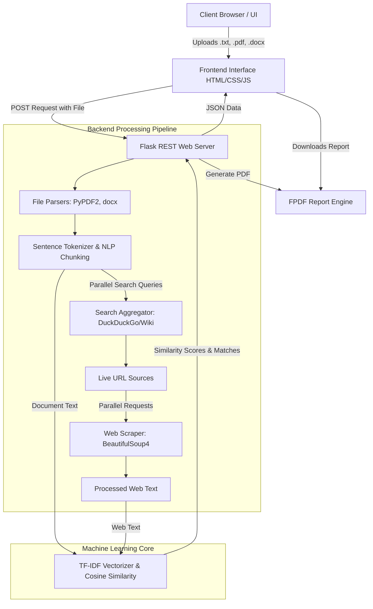

# Plagiarism Detection System 🔍


A professional, full-stack, web-based intelligent plagiarism detection application. This system empowers educators, writers, and professionals to evaluate the originality of multi-format documents by cross-referencing extracted text with live web resources through ultra-fast, parallelized web scraping and machine learning.

---

## 🏗 System Architecture 

The application utilizes a Client-Server architecture alongside a highly optimized, concurrent Natural Language Processing (NLP) pipeline for real-time text analysis.



## ✨ Core Features

- **Multi-Format Document Parsing:** Native support for parsing `.txt`, `.pdf`, and `.docx` files flawlessly.
- **Ultra-Fast Parallel Web Search:** Leverages `ThreadPoolExecutor` to perform concurrent web searches via DuckDuckGo and Wikipedia APIs.
- **Intelligent Text Analysis:** Uses TF-IDF vectorization and Cosine Similarity through `scikit-learn` to calculate deterministic originality scores.
- **Dynamic Content Extraction:** Automated, targeted web scraping via `BeautifulSoup` that intelligently filters out boilerplate elements (navbars, footers, scripts).
- **Premium User Interface:** Responsive dashboard infused with modern glass-morphism aesthetics, dark-mode styling, and smooth animated data visualizations.
- **Comprehensive PDF Reporting:** Secure, on-the-fly generation of detailed plagiarism scan reports tailored for immediate download.
- **Secure Authentication:** Embedded SQLite with SQLAlchemy for robust session-based user authentication and password hashing.

## 💻 Technology Stack

| Component | Technologies Used |
| :--- | :--- |
| **Backend** | Python 3, Flask, SQLAlchemy, ThreadPoolExecutor |
| **Frontend** | HTML5, CSS3 (Vanilla / Glassmorphism), JavaScript |
| **NLP & ML** | Scikit-Learn (TF-IDF, Cosine Similarity) |
| **Search & Scrape** | DuckDuckGo-Search, Wikipedia API, BeautifulSoup4, Requests |
| **Parsing & Export**| PyPDF2, python-docx, FPDF2 |
| **Database** | SQLite3 |

## 📁 Project Structure

```text
├── app.py                   # Main Flask Application & Routing
├── plagiarism_checker.py    # Core NLP, scraping, and scoring logic
├── requirements.txt         # Project dependencies list
├── instance/
│   └── users.db             # SQLite Database (Auto-generated)
├── static/                  # CSS styles, JavaScript and static assets
├── templates/               # HTML Jinja2 Templates (auth.html, index.html)
└── uploads/                 # Temporary directory for processing uploads and reports
```

## 🚀 Setup & Installation

To run this application locally on your machine, follow these structured steps:

### 1. Clone the Repository
```bash
git clone <your-repository-url>
cd plagiarism-checker
```

### 2. Set Up a Virtual Environment (Recommended)
Isolate your dependencies to avoid system-level conflicts:
```bash
# General Command
python -m venv venv

# Activate on Windows:
venv\Scripts\activate

# Activate on Mac/Linux:
source venv/bin/activate
```

### 3. Install Dependencies
```bash
pip install -r requirements.txt
```

### 4. Run the Application
Start the Flask development server:
```bash
python app.py
```
*The application should now be running internally on `http://127.0.0.1:10000` (or the default Flask port `5000` depending on the `.env` settings).*

## 💡 Usage Workflow

1. **Sign Up / Login:** Securely authenticate via the portal.
2. **Upload:** Drag-and-drop or select a document (`.pdf`, `.docx`, `.txt`) into the scanning dashboard.
3. **Analyze:** The backend instantly parallelizes search queries and analyzes scraped web content against your document using Machine Learning algorithms.
4. **Review Results:** Real-time exact matched phrases, overall similarity scores, and suspect URLs are rendered via interactive UI widgets.
5. **Download Report:** Generate and download a professional PDF report summarizing the scan results.

---

### 👨‍💻 Author
Designed and Developed by **Rachana RV**.
