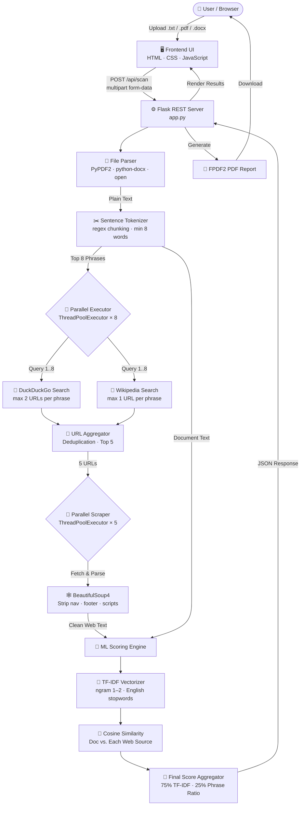
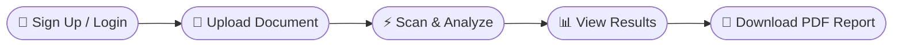

<div align="center">

# 🔍 UniChecker
### Intelligent Plagiarism Detection System

*A full-stack document originality verification platform powered by Machine Learning and real-time web analysis.*

<br/>

[](https://python.org)
[](https://flask.palletsprojects.com)
[](https://scikit-learn.org)
[](https://sqlite.org)
[](LICENSE)

<br/>

> **Upload any document — get a precise similarity score, flagged phrases, and matching source URLs in seconds.**

</div>

---

## 📌 Table of Contents

1. [Overview](#-overview)
2. [Key Features](#-key-features)
3. [System Architecture](#-system-architecture)
4. [NLP Processing Pipeline](#-nlp-processing-pipeline)
5. [Technology Stack](#-technology-stack)
6. [Project Structure](#-project-structure)
7. [Setup & Installation](#-setup--installation)
8. [Usage Workflow](#-usage-workflow)
9. [UI Highlights](#-ui-highlights)
10. [Author](#-author)

---

## 🧭 Overview

**UniChecker** is a production-grade, full-stack plagiarism detection web application. It extracts text from uploaded documents and intelligently cross-references content against live web sources using a parallelized NLP pipeline — delivering fast, accurate, and readable originality scores through a premium dark-mode UI.

Whether you're an **academic**, **content creator**, or **developer**, UniChecker provides the transparency and depth you need to ensure document integrity.

---

## ✨ Key Features

| # | Feature | Description |
|:---:|:---|:---|
| 1 | 📄 **Multi-Format Parsing** | Supports `.txt`, `.pdf`, and `.docx` file uploads |
| 2 | ⚡ **Parallel Web Search** | Concurrent queries via DuckDuckGo & Wikipedia using `ThreadPoolExecutor` |
| 3 | 🧠 **TF-IDF Similarity Scoring** | Cosine similarity via `scikit-learn` with unigram + bigram vectorization |
| 4 | 🌐 **Smart Web Scraping** | `BeautifulSoup4` strips boilerplate and extracts meaningful web content |
| 5 | 📊 **Visual Analytics Dashboard** | Animated circular similarity gauge with color-coded risk indicators |
| 6 | 📝 **PDF Report Export** | Instant downloadable scan reports generated via `FPDF2` |
| 7 | 🔐 **Secure Authentication** | Session-based login with `werkzeug` hashed passwords + `SQLAlchemy` |
| 8 | ☁️ **Cloud-Ready** | Serverless-compatible with `/tmp` path fallbacks for Vercel deployment |

---

## 🏗 System Architecture

The application is built on a **layered Client–Server architecture** with a concurrent NLP backend pipeline:



### Scoring Formula

$$\text{Final Score} = \left(\max(\text{TF-IDF Similarity}) \times 0.75\right) + \left(\frac{\text{Matched Phrases}}{\text{Total Phrases}} \times 0.25\right)$$

| Score Range | Risk Level | Indicator |
|:---:|:---|:---:|
| 0% – 20% | ✅ Original | 🟢 Green |
| 21% – 50% | ⚠️ Moderate Similarity | 🟡 Yellow |
| 51% – 100% | 🚨 High Plagiarism Risk | 🔴 Red |

---

## 🧠 NLP Processing Pipeline

```mermaid
flowchart LR
    A([📄 Document Upload]) --> B[Text Extraction\nPyPDF2 · docx · open]
    B --> C[Sentence Tokenization\nregex split on period/question]
    C --> D[Phrase Validation\nmin 8 words · strip commons]
    D --> E[Parallel Search\nThreadPoolExecutor × 8]
    E --> F[URL Collection\nDDGS + Wikipedia]
    F --> G[Parallel Scraping\nThreadPoolExecutor × 5]
    G --> H[Content Cleaning\nBeautifulSoup4]
    H --> I[TF-IDF Vectorization\nngram_range 1–2]
    I --> J[Cosine Similarity\nper-site + aggregate]
    J --> K[Weighted Final Score]
    K --> L([📊 JSON Result])
```



---

## 💻 Technology Stack

<div align="center">

| Layer | Technology | Role |
|:---|:---|:---|
| **Web Framework** | `Flask 2.x` | REST routing, Jinja2 templating, session management |
| **Frontend** | `HTML5` · `CSS3` · `Vanilla JS` | Glassmorphic UI, drag-and-drop, animated charts |
| **Machine Learning** | `Scikit-Learn` | TF-IDF vectorization, cosine similarity scoring |
| **Web Search** | `duckduckgo-search` · `wikipedia` | Real-time live source URL discovery |
| **Web Scraping** | `BeautifulSoup4` · `Requests` | Structured web content extraction |
| **File Parsing** | `PyPDF2` · `python-docx` | Multi-format document text extraction |
| **PDF Generation** | `FPDF2` | Downloadable plagiarism report creation |
| **Database & ORM** | `SQLite3` · `SQLAlchemy` | User accounts and session persistence |
| **Security** | `Werkzeug` | Password hashing, secure HTTP sessions |
| **Concurrency** | `ThreadPoolExecutor` | Parallel search + parallel scraping |

</div>

---

## 📁 Project Structure

```
plagiarism-checker/
│
├── 📄 app.py                       # Flask application — all routes, auth & PDF generation
├── 🧠 plagiarism_checker.py        # Core NLP engine — search, scrape, score
├── 📦 requirements.txt             # All Python package dependencies
│
├── 📂 templates/
│   ├── auth.html                   # Login & Signup page (Jinja2)
│   └── index.html                  # Main scan dashboard with upload & results
│
├── 📂 static/
│   ├── css/
│   │   └── style.css               # Glassmorphism dark-mode styles & animations
│   └── js/
│       └── main.js                 # Async API calls, chart rendering, upload handling
│
├── 📂 instance/
│   └── users.db                    # Auto-generated SQLite user database
│
├── 📂 uploads/                     # Temp directory for file uploads & PDF exports
├── 🔧 inspect_ddgs.py              # DuckDuckGo API inspection utility
└── 🧪 test_debug.py                # Local debug & testing script
```

---

## 🚀 Setup & Installation

### Prerequisites

- Python **3.8+** installed
- `pip` package manager
- Active Internet connection *(required for live web search)*

---

### Step 1 — Clone the Repository

```bash
git clone https://github.com/rachanarv17/Plagiarism-checker.git
cd Plagiarism-checker
```

### Step 2 — Create a Virtual Environment *(Recommended)*

```bash
# Create environment
python -m venv venv

# Activate on Windows
venv\Scripts\activate

# Activate on macOS / Linux
source venv/bin/activate
```

### Step 3 — Install All Dependencies

```bash
pip install -r requirements.txt
```

### Step 4 — Run the Application

```bash
python app.py
```

### Step 5 — Access in Browser

```
http://127.0.0.1:10000
```

---

## 💡 Usage Workflow



| Step | Action | Detail |
|:---:|:---|:---|
| 1 | 🔐 **Sign Up / Login** | Authenticate securely via the built-in portal |
| 2 | 📁 **Upload Document** | Drag-and-drop or browse for a `.txt`, `.pdf`, or `.docx` |
| 3 | ⚡ **Scan & Analyze** | Backend parallelizes searches and calculates similarity in real-time |
| 4 | 📊 **View Results** | See similarity score, flagged phrases, and matched source URLs |
| 5 | 📄 **Download Report** | Export a complete PDF summary with one click |

---

## 🎨 UI Highlights

- 🌑 **Dark glassmorphism design** with layered frosted-glass panel effects
- 🔵 **Animated SVG circular gauge** with gradient stroke for similarity score
- 🚦 **Color-coded risk levels** — green, orange, and red thresholds
- 📎 **Drag-and-drop file upload** with real-time filename preview
- 📱 **Fully responsive layout** — optimized for desktop and mobile
- ✨ **Smooth reveal animations** on results load with CSS keyframes

---

## 👩‍💻 Author

<div align="center">

**Designed & Developed with ❤️ by Rachana RV**

<br/>

[](https://github.com/rachanarv17)

<br/>

*If you found this project helpful, please consider giving it a ⭐ on GitHub!*

</div>
